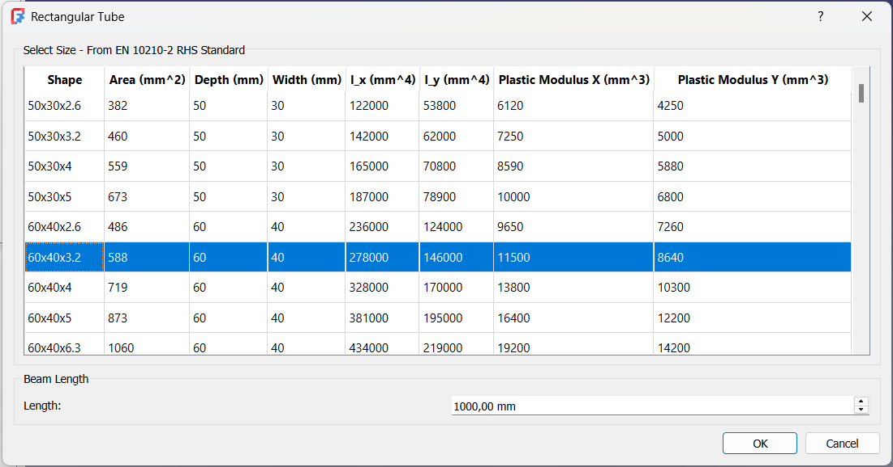
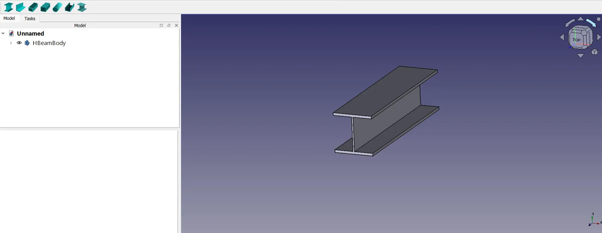
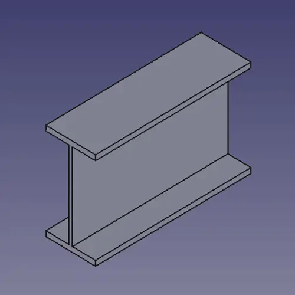
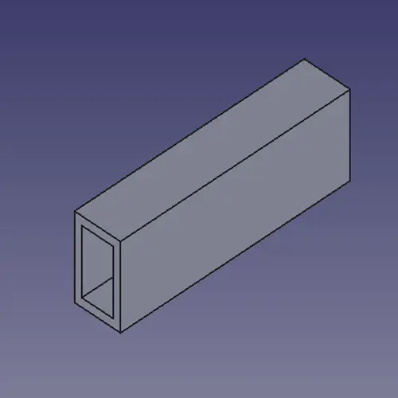
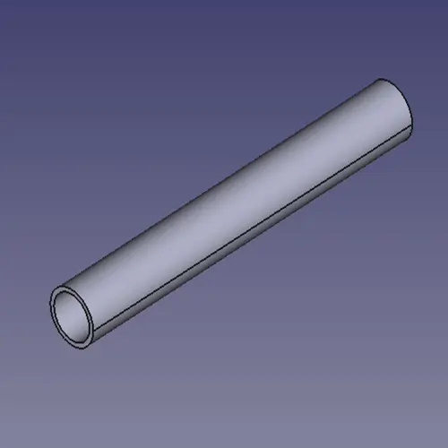
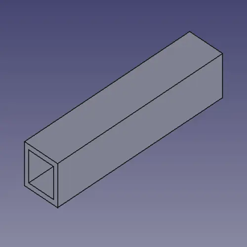
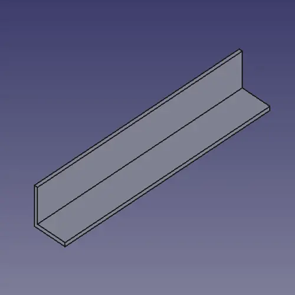
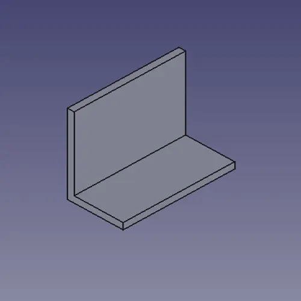
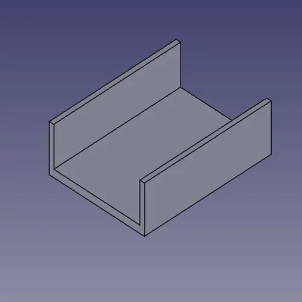

# Standard Beams

A simple FreeCAD tool for working with standard beam dimensions.

View section properties such as area, depth, width, moments of inertia (X/Y), and plastic modulus (X/Y).
Select a beam type, choose a standard size, and it will insert the beam directly into your FreeCAD document.

## Different Beams

# I-Beams

# Rectangular Tubes

# Round Tubes

# Square Tubes

# Equal and Unequal L-Angles

# C-Channel

# H-Beams

## Current Standards
- I-Beam
    - IPE (EN 10365)
    - IPN (EN 10365)
- L-Angle
    - Equal Leg (EN 10056-1)
    - Unequal Leg (EN 10056-1)
- Rectangular Tubes
    - RHS (EN 10210-2)
- Square Tubes
    - SHS (EN 10210-2)
- Round Tubes
    - CHS (EN 10210-2)
- C-Channels
    - UAP (EN 10365)
    - UPE (EN 10365)
    - UPN (EN 10365)
- H-Beams
    - HD (EN 10365)
    - HE (EN 10365)
    - HL (EN 10365)
    - HP (EN 10365)

Note: this is the first version of the Addon. More Beams And Standards will be added

