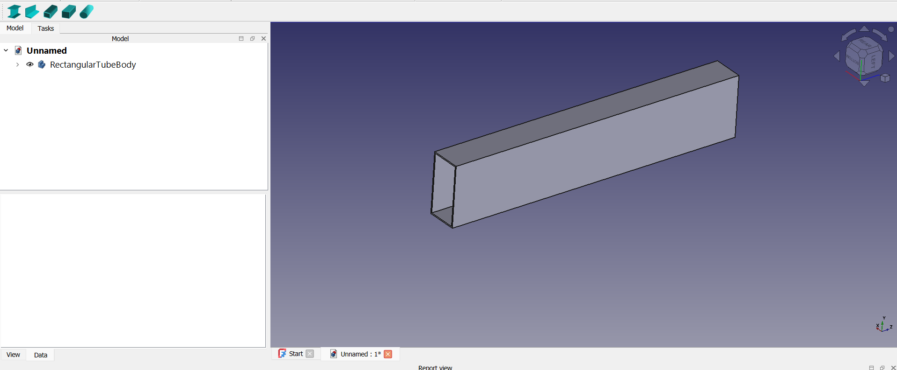
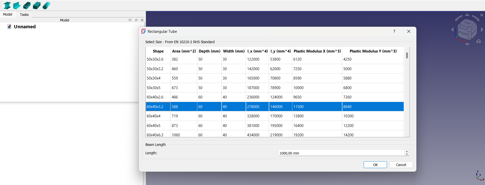

# Standard Beams

A simple tool for beam-dimensions and standards inside FreeCAD

## Different Beams

* I-Beams (Standard IPN)
* Rectangular Tubes (RHS)
* Round Tubes (CHS)
* Square Tubes (SHS)
* Equal and Unequal Angles

You can see the Area, Depth, Width, Inertia around x/y, and Plastic Modulus around x/y

Note: this is the first version of the Addon. More Beams And Standards will be added

