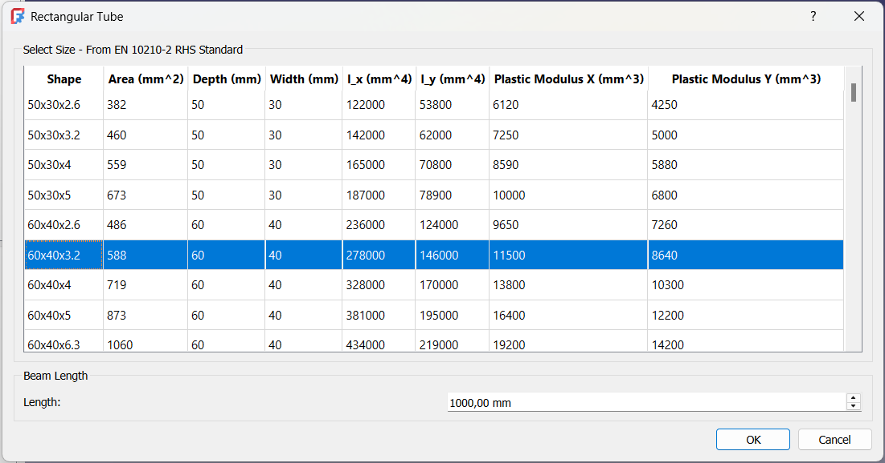
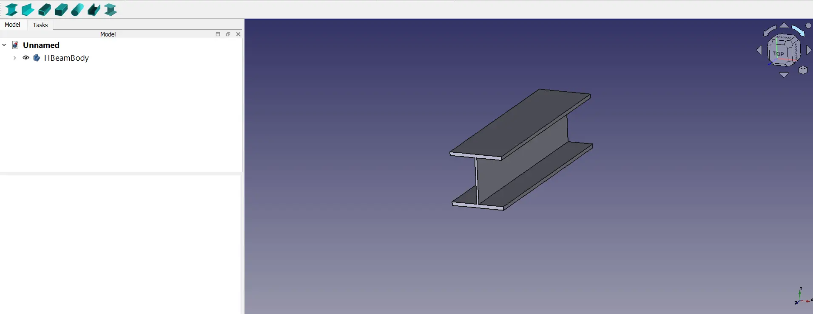

# Standard Beams

A simple FreeCAD tool for working with standard beam dimensions.

View properties such as area, depth, width, moments of inertia (X/Y), and plastic modulus (X/Y).
Select a beam type, choose a standard size, and it will insert the beam directly into your FreeCAD document.





## Repo Structure

```text
├── freecad/
│   └── StandardBeams/           # Main addon source code
│       ├── Beams/               
│       │   ├── C_Channel/       # Generation Code, Command, Standards, and Dialog
│       │   ├── H_Beam/
│       │   ├── I_Beam/
│       │   ├── L_Angle/
│       │   ├── Rectangular_Tube/
│       │   ├── Round_Tube/
│       │   └── Square_Tube/
│       ├── Misc/                
│       ├── Qt/                  
│       ├── Resources/           # Data (CSVs) and icons for the addon
│       ├── Command.py           
│       ├── init_gui.py          
│       └── Workbench.py         # Workbench setup
├── Resources/                   # Media and Overview for the repository
├── LICENSE-CODE                 # LGPL-2.1 license for the code
├── LICENSE-ICON                 # CC-BY-SA-4.0 license for icons
├── package.xml                  # FreeCAD metadata file
├── pyproject.toml               
└── README.md                    
```

Feel Free to contribute to the repo with new Standards, or other feature ideas.

## License
- **Code**: [LGPL-2.1](LICENSE-CODE) - GNU Lesser General Public License v2.1
- **Icons**: [CC-BY-SA-4.0](LICENSE-ICON) - Creative Commons Attribution-ShareAlike 4.0 International