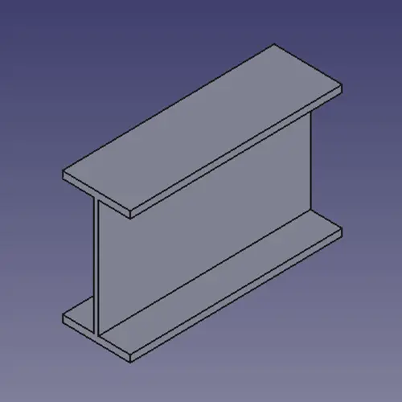
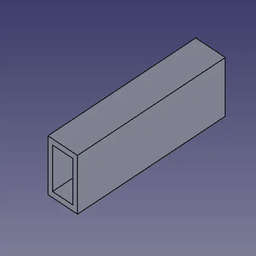
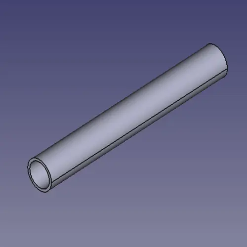
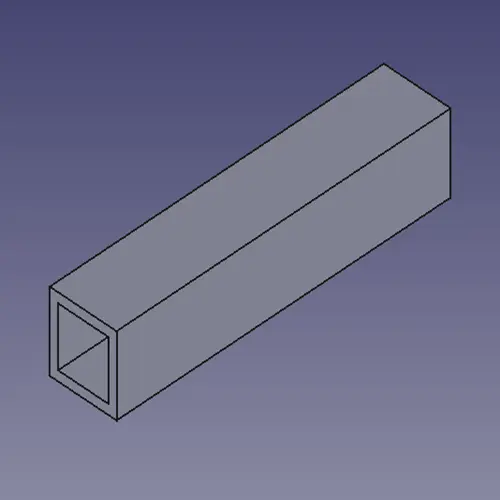
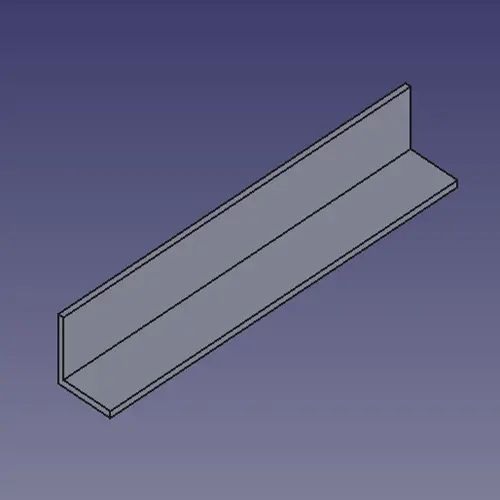
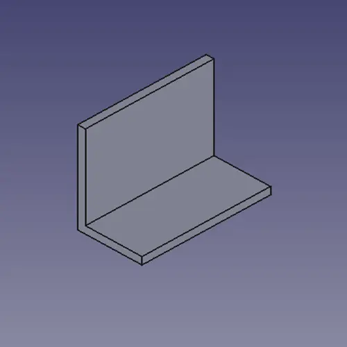
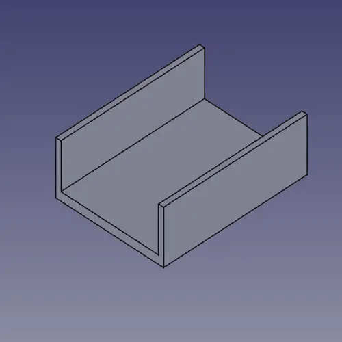
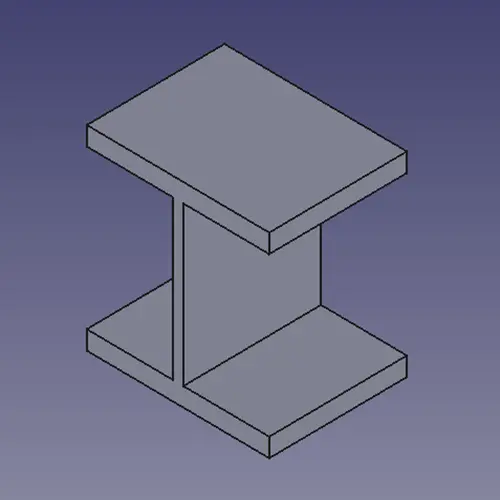

# Standard Beams

A simple FreeCAD tool for working with standard beam dimensions.

View section properties such as area, depth, width, moments of inertia (X/Y), and plastic modulus (X/Y).
Select a beam type, choose a standard size, and it will insert the beam directly into your FreeCAD document.

## Usage
- Install the addon
- Open the addon
- Click on the beam you want
- Find the size you want
- Pick a length (can always be changed)
- Click 'Ok'
    - if a document is active it will add the beam in that document
    - else it will make a new document and add it

## Different Beams

### I-Beams
- IPE (EN 10365)
- IPN (EN 10365)

### Rectangular Tubes
- RHS (EN 10210-2)

### Round Tubes
- CHS (EN 10210-2)

### Square Tubes
- SHS (EN 10210-2)

### Equal and Unequal L-Angles
- Equal Leg (EN 10056-1)
- Unequal Leg (EN 10056-1)

### C-Channel
- UAP (EN 10365)
- UPE (EN 10365)
- UPN (EN 10365)

### H-Beams
- HD (EN 10365)
- HE (EN 10365)
- HL (EN 10365)
- HP (EN 10365)

## Contribute
Contribute
[here](https://github.com/MortenVajhoj/StandardBeams)
